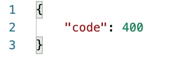
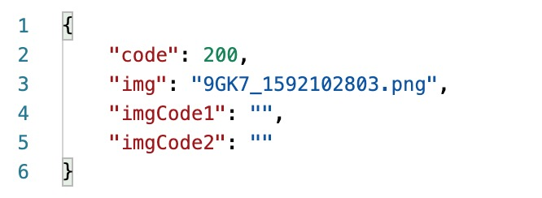
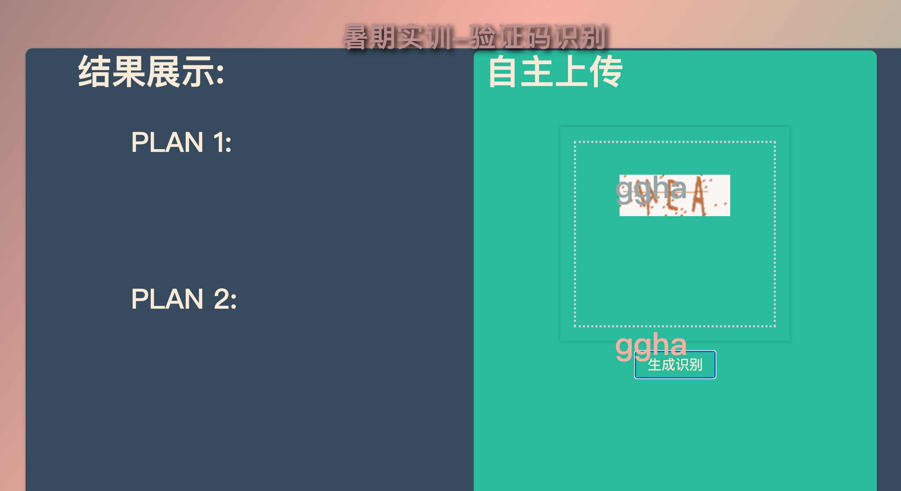
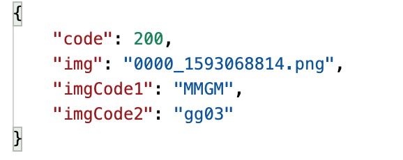

## 后端接口文档

访问前端网页路径

ip:host/imgProcess/index

1. /imgProcess/upload

接口描述：利用post请求该接口，上传用户验证码图片，返回验证码结果

请求参数：[

    "img": 用户上传的图片
    
]

返回参数：[
    
    "code": 200,结果成功；400,结果失败
    
    "imgCode1": 验证码识别结果，str类型，灿哲的识别结果
    
    "imgCode2": 验证码识别结果，str类型，郭奕的识别结果

]

返回示例：

成功返回

失败返回

结果展示：

2. /imgProcess/createImg

接口描述：请求该接口，获取随机一张验证码照片和验证码结果

请求参数：无

返回参数：[

    "code": 200
    
    "img": 图片文件名
    
    "imgCode1": 验证码结果，灿哲的结果
    
    "imgCode2": 验证码结果，郭奕的结果

]

返回示例：

结果展示：

3. /imgProcess/downloadImg

接口描述：请求该接口，传入图片的url，返回该图片的识别结果

请求方式：GET

请求参数：[

    "imgUrl": 图片的路径

]

返回参数：[

    "code": 200

    "img": 图片的文件名，图片在media文件夹下
    
    "imgCode1": 验证码结果，灿哲的结果
    
    "imgCode2": 验证码结果，郭奕的结果
    
]

返回示例：

## 后端目录

1. imgProcess 下的 end2end_model 是端到端的识别模型
2. imgProcess 下的 segmentation_model 是分割后识别的模型
